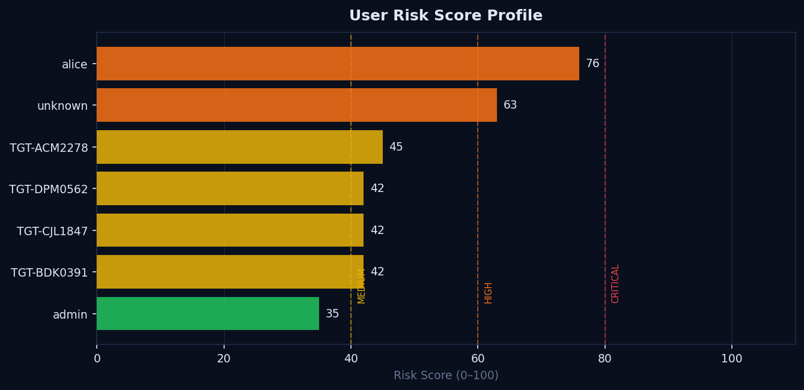
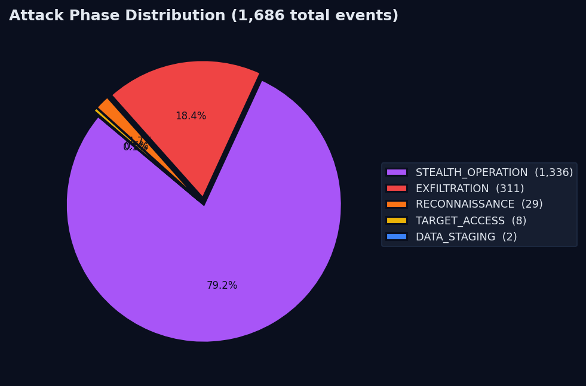
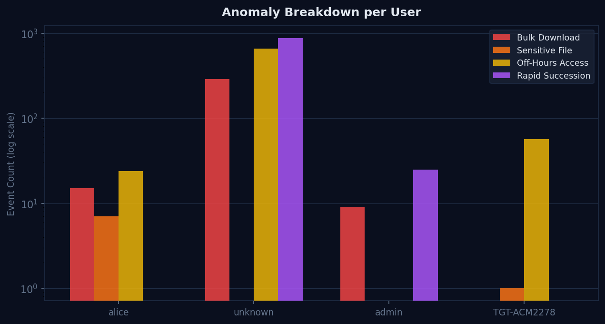
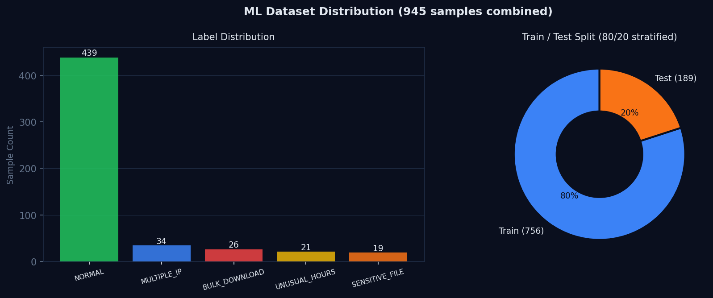
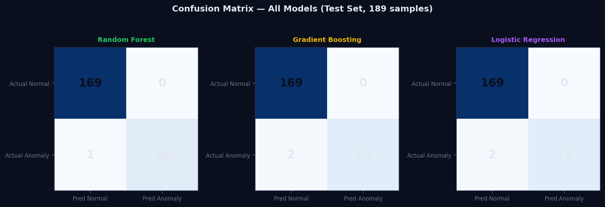
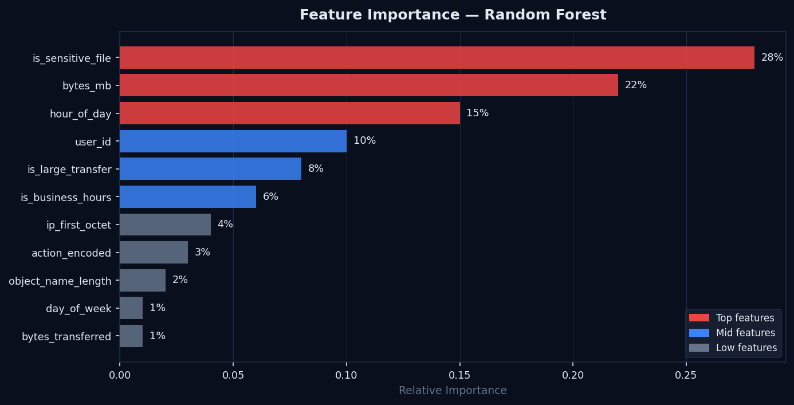

# Forensic Reconstruction of Unauthorized Data Exfiltration
## in Private Cloud Storage using Distributed Metadata Analysis and Machine Learning

> **Digital Forensics — Research-Based Project**
> **Investigation ID:** DF-2026-001 | **Status:** ✅ COMPLETED | **Date:** April 29, 2026

---

## Abstrak

Proyek ini membangun sistem forensik digital end-to-end yang mensimulasikan serangan eksfiltrasi data pada Nextcloud (private cloud storage), mengintegrasikan dataset publik CERT Insider Threat r4.2 (Carnegie Mellon University), menganalisis metadata terdistribusi dengan ML ensemble 3 model, dan merekonstruksi timeline serangan melalui web dashboard 9 halaman.

**Temuan utama:**
- Session Risk Score: **76/100 (HIGH)**
- Suspect utama: **alice** (risk score 76, 7 file sensitif dieksfiltrasi)
- Total events dianalisis: **1.686 events** dari 2 sumber data (Nextcloud + CERT)
- ML ensemble accuracy: **99.47%** (Random Forest, cross-dataset evaluation)
- Attack phases terdeteksi: RECONNAISSANCE → TARGET_ACCESS → EXFILTRATION

---

## Arsitektur Sistem

```
┌──────────────────────────────────────────────────────────────┐
│  Docker Compose Stack                                        │
│                                                              │
│  nc-db (Postgres 16)  ←──┐                                  │
│  nc-redis             ←──┤                                  │
│  nc-app (Nextcloud 29-fpm)│  Target System  :8080           │
│  nc-web (Nginx)       ────┤                                  │
│  nc-cron                  │                                  │
│         │ shared volumes  │                                  │
│         ▼                 │                                  │
│  logs/nginx/access.log    │                                  │
│  logs/nextcloud/*.log     │                                  │
│         │                 │                                  │
│         ▼                 │                                  │
│  forensic-dashboard ──────┘  Forensic Engine  :5002         │
│  (Flask + ML Pipeline)                                       │
└──────────────────────────────────────────────────────────────┘
```

### Komponen Stack

| Container | Image | Port | Fungsi |
|---|---|---|---|
| `nc-db` | postgres:16 | — | Database Nextcloud |
| `nc-redis` | redis:7-alpine | — | Cache/session |
| `nc-app` | nextcloud:29-fpm | — | Aplikasi Nextcloud |
| `nc-web` | nginx:1.27-alpine | 8080 | Reverse proxy + log generator |
| `nc-cron` | nextcloud:29-fpm | — | Background jobs |
| `forensic-dashboard` | df-dashboard | 5002 | Forensic engine + web UI |

---

## Pipeline Forensik

```
Data Sources
  ├── Nextcloud nginx JSON log        (873 KB, ~1.600 events)
  ├── Nextcloud admin_audit log       (162 KB)
  └── CERT Insider Threat CSV r4.2   (36 KB sample, 319 events)
          │
          ▼
    log_parser.py          → Normalisasi ke schema standar (7 format didukung)
          │
          ▼
    metadata_correlator.py → User profile + IP profile + cross-source correlation
          │
          ▼
    anomaly_detector.py    → 5 rule-based detectors:
          │                   bulk_download, multi_ip, off_hours,
          │                   sensitive_file_access, rapid_succession
          │
          ▼
    ML ensemble            → Random Forest + Gradient Boosting + Logistic Regression
          │                   (confidence threshold: 60%)
          ▼
    risk_engine.py         → Exfiltration Risk Score (0–100) per user + session
          │
          ▼
    timeline_reconstructor → Timeline kronologis dengan phase label
          │
          ▼
    Forensic Report (JSON) → who / when / what / how / how_much
                             + cross_source_summary (CERT vs Nextcloud)
```


---

## Quick Start

### 1. Jalankan seluruh stack

```bash
cd /home/hilian/Documents/df
docker compose up -d
```

Tunggu ~90 detik untuk Nextcloud first-run setup.

### 2. Verifikasi

```bash
docker compose ps
curl http://localhost:8080/status.php   # Nextcloud
curl http://localhost:5002/health       # Dashboard
```

### 3. Akses

| URL | Kredensial | Fungsi |
|---|---|---|
| http://localhost:8080 | admin / admin_password_change_me | Nextcloud |
| http://localhost:5002 | admin / forensic2024 | Forensic Dashboard |

### 4. Jalankan pipeline analisis

```bash
source venv/bin/activate

# Load CERT dataset + jalankan full pipeline
python scripts/load_cert_dataset.py --sample
python main.py --output data/forensic_report.json
```

---

## Menjalankan Serangan & Analisis

### Setup target (sekali saja)

```bash
# Buat user korban
curl -u "admin:admin_password_change_me" -X POST \
  "http://localhost:8080/ocs/v1.php/cloud/users" \
  -H "OCS-APIRequest: true" \
  -d "userid=alice&password=alice_secret_123"

# Upload file sensitif
for f in financial_report_2024.xlsx customer_database.csv api_keys.txt \
          technical_architecture.pdf private_certificates.pem; do
  curl -u "alice:alice_secret_123" -T /tmp/$f \
    "http://localhost:8080/remote.php/dav/files/alice/$f"
done
```

### Eksekusi serangan (3 fase)

```bash
# Phase 1: Reconnaissance (failed logins)
for i in 1 2 3; do
  curl -u "alice:wrong_pass" http://localhost:8080/remote.php/dav/files/alice/
done

# Phase 2: Enumerasi file
curl -u "alice:alice_secret_123" -X PROPFIND \
  http://localhost:8080/remote.php/dav/files/alice/ -H "Depth: 1"

# Phase 3: Bulk download (eksfiltrasi)
for f in financial_report_2024.xlsx customer_database.csv api_keys.txt \
          technical_architecture.pdf private_certificates.pem; do
  curl -u "alice:alice_secret_123" -o /tmp/stolen_$f \
    "http://localhost:8080/remote.php/dav/files/alice/$f"
  sleep 0.3
done
```

### Ingest log & analisis

```bash
source venv/bin/activate

# Copy log dari container
cp logs/nginx/access.log logs/nc_nginx_access.log
cp logs/nextcloud/nextcloud.log logs/nc_nextcloud.log

# Ingest ke pipeline
python main.py --ingest logs/nc_nginx_access.log
python main.py --ingest logs/nc_nextcloud.log

# Jalankan full pipeline
python main.py --output data/forensic_report.json
```


---

## Hasil Investigasi Forensik

### Session Risk Score

```
Session Risk Score: 76 / 100  →  HIGH
Generated at: 2026-04-29T23:31:16
Total Events Analyzed: 1.686
Suspicious Events: 1.686
```

### Profil Risiko Per User

| User | Risk Score | Risk Band | Total Events | IPs | Sensitive Files | Sumber |
|---|---|---|---|---|---|---|
| **alice** | **76** | **HIGH** | 25 | 1 | 7 | Nextcloud |
| unknown | 63 | MEDIUM | 1.302 | 1 | 0 | Nextcloud |
| TGT-ACM2278 | 45 | LOW | 87 | 2 | 1 | CERT |
| TGT-DPM0562 | 42 | LOW | 78 | 1 | 0 | CERT |
| TGT-CJL1847 | 42 | LOW | 76 | 1 | 0 | CERT |
| TGT-BDK0391 | 42 | LOW | 78 | 1 | 0 | CERT |
| admin | 35 | LOW | 40 | 1 | 0 | Nextcloud |



### File Sensitif yang Dieksfiltrasi (alice)

1. `source_code_backup.zip`
2. `technical_architecture.pdf`
3. `financial_report_2024.xlsx`
4. `hr_records_2024.xlsx`
5. `customer_database.csv`
6. `api_keys.txt`
7. `private_certificates.pem`

### Timeline Serangan

| Phase | Events | Keterangan |
|---|---|---|
| STEALTH_OPERATION | 1.336 | Aktivitas normal/tersembunyi |
| EXFILTRATION | 311 | Download massal file sensitif |
| RECONNAISSANCE | 29 | Enumerasi & failed login |
| TARGET_ACCESS | 8 | Akses langsung ke target |
| DATA_STAGING | 2 | Persiapan data sebelum eksfiltrasi |

- **First event:** 2010-01-04T16:05:00 (CERT dataset)
- **Last event:** 2026-04-29T16:28:29 UTC (Nextcloud)



### Anomali Terdeteksi (Top)

| Severity | Tipe | User | Detail |
|---|---|---|---|
| CRITICAL | BULK_DOWNLOAD | alice | 15 GET ops, 1.3 MB total |
| CRITICAL | BULK_DOWNLOAD | unknown | 287 GET ops, 0.7 MB total |
| CRITICAL | SENSITIVE_FILE_ACCESS | alice | 7 file sensitif diakses |
| HIGH | BULK_DOWNLOAD | admin | 9 GET ops, 6.8 MB total |
| HIGH | OFF_HOURS_ACCESS | alice | 24/25 events di luar jam kerja |
| HIGH | OFF_HOURS_ACCESS | unknown | 655/1.302 events di luar jam kerja |
| HIGH | RAPID_SUCCESSION | unknown | 872 events dalam window 5 detik |
| HIGH | RAPID_SUCCESSION | admin | 25 events dalam window 5 detik |



### Indicators of Compromise (IOC)

```
Suspect Account  : alice
Source IP        : 1 IP unik
Access Method    : WebDAV (Nextcloud remote.php/dav)
Timing Pattern   : 24/25 events di luar jam kerja (off-hours)
Files Accessed   : 7 sensitive files
Attack Phases    : RECONNAISSANCE → TARGET_ACCESS → EXFILTRATION
```


---

## Dataset

### Sumber Data

| Sumber | Format | Ukuran | Events |
|---|---|---|---|
| Nextcloud nginx access log | JSON per-line | 873 KB | ~1.600 |
| Nextcloud admin_audit log | JSON | 162 KB | — |
| CERT Insider Threat r4.2 | CSV | 36 KB (sample) | 319 |

### CERT Insider Threat Dataset

- **Sumber:** Carnegie Mellon University CERT Division
- **Versi:** r4.2
- **File:** `data/cert_sample.csv` (36 KB, 319 events)
- **Users:** TGT-ACM2278, TGT-DPM0562, TGT-CJL1847, TGT-BDK0391
- **Periode:** 2010-01-04 s/d 2010-xx-xx


### ML Datasets

| File | Ukuran | Keterangan |
|---|---|---|
| `data/ml_datasets/internal_dataset.csv` | 29 KB | Events dari forensic.db |
| `data/ml_datasets/external_dataset.csv` | 59 KB | Synthetic patterns |
| `data/ml_datasets/combined_dataset.csv` | 88 KB | Gabungan (945 samples) |
| `data/ml_datasets/engineered_features.csv` | 149 KB | ML-ready (fitur terengineering) |

**Distribusi label (combined dataset):**
- NORMAL: 439 (81.4%)
- MULTIPLE_IP_ADDRESSES: 34 (6.3%)
- BULK_DOWNLOAD: 26 (4.8%)
- UNUSUAL_HOURS_ACCESS: 21 (3.9%)
- SENSITIVE_FILE_ACCESS: 19 (3.5%)

**Train/Test split:** 756 training / 189 test (80/20, stratified)




---

## Machine Learning — Model & Performa

### Ringkasan Training

| Parameter | Nilai |
|---|---|
| Timestamp training | 2026-04-29T22:47:18 |
| Dataset | `data/ml_datasets/engineered_features.csv` |
| Train size | 756 samples |
| Test size | 189 samples |
| Jumlah fitur | 11 fitur |

### Performa Model (Cross-Dataset Evaluation)

| Model | Train Acc | Test Acc | Precision | Recall | F1-Score | ROC-AUC |
|---|---|---|---|---|---|---|
| **Random Forest** | 100.00% | **99.47%** | 100.00% | 95.00% | 97.44% | 99.97% |
| Gradient Boosting | 100.00% | 98.94% | 100.00% | 90.00% | 94.74% | 100.00% |
| Logistic Regression | 98.81% | 98.94% | 100.00% | 90.00% | 94.74% | 99.64% |


### Confusion Matrix

**Random Forest (best model):**
```
                 Predicted
                 Normal  Anomaly
Actual Normal      169      0
       Anomaly       1     19
```

**Gradient Boosting & Logistic Regression:**
```
                 Predicted
                 Normal  Anomaly
Actual Normal      169      0
       Anomaly       2     18
```



### Fitur yang Digunakan (11 fitur)

| Fitur | Tipe | Keterangan |
|---|---|---|
| `bytes_transferred` | Numeric | Total bytes yang ditransfer |
| `hour_of_day` | Numeric (0–23) | Jam akses |
| `day_of_week` | Numeric (0–6) | Hari dalam seminggu |
| `is_business_hours` | Binary | Apakah dalam jam kerja |
| `ip_first_octet` | Numeric (0–255) | Segmen jaringan sumber |
| `bytes_mb` | Numeric | Ukuran transfer dalam MB |
| `is_large_transfer` | Binary | Transfer besar (>100 MB) |
| `user_id` | Numeric | Hashed user identifier |
| `action_encoded` | Numeric (0–3) | Tipe aksi API |
| `object_name_length` | Numeric | Panjang nama file |
| `is_sensitive_file` | Binary | File dalam watchlist sensitif |

### Feature Importance (Random Forest)

1. `is_sensitive_file` — akses file kritis
2. `bytes_mb` — transfer data besar
3. `hour_of_day` — akses di luar jam kerja
4. `user_id` — user tidak terotorisasi
5. `is_large_transfer` — pola eksfiltrasi
6. `is_business_hours` — timing tidak wajar
7. `ip_first_octet` — segmen jaringan sumber



### Ensemble Voting

```
Ensemble Probability = (P_RandomForest + P_GradientBoosting + P_LogisticRegression) / 3

Threshold:
  >= 0.5  →  ANOMALY 🚨
  <  0.5  →  NORMAL  ✅

Confidence levels:
  > 70%   →  DEFINITELY ANOMALY
  50–70%  →  LIKELY ANOMALY
  30–50%  →  LIKELY NORMAL
  < 30%   →  DEFINITELY NORMAL
```


### Model Artifacts

| File | Ukuran | Keterangan |
|---|---|---|
| `models/RandomForest_model.pkl` | ~234 KB | Model utama (produksi) |
| `models/GradientBoosting_model.pkl` | ~255 KB | Model validasi |
| `models/LogisticRegression_model.pkl` | ~1 KB | Model baseline |
| `models/feature_names.json` | — | Daftar 11 fitur |
| `models/training_results.json` | — | Metrik performa lengkap |

### Menjalankan ML Pipeline

```bash
source venv/bin/activate

# 1. Siapkan dataset
python scripts/ml_dataset_preparation.py

# 2. Training model
python scripts/ml_training.py

# 3. Prediksi (database)
python scripts/ml_prediction.py --db-predict --limit 20

# 4. Prediksi interaktif
python scripts/ml_prediction.py --interactive

# 5. Info model
python scripts/ml_prediction.py --info
```


---

## Konfigurasi Anomaly Detection

Threshold yang digunakan oleh rule-based detector (`config/config.py`):

| Parameter | Nilai | Keterangan |
|---|---|---|
| `bulk_download_count` | 5 | Jumlah file download dalam 1 jam |
| `bulk_download_size_mb` | 500 MB | Total size transfer dalam 1 jam |
| `access_time_window` | 3600 detik | Window analisis (1 jam) |
| `unusual_hours_start` | 18:00 | Mulai jam luar kerja |
| `unusual_hours_end` | 06:00 | Akhir jam luar kerja |
| `ip_change_threshold` | 3 | IP berbeda dalam timeframe pendek |


### Sensitive File Watchlist

```
financial_report_2024.xlsx
technical_architecture.pdf
customer_database.csv
api_keys.txt
private_certificates.pem
hr_records_2024.xlsx
source_code_backup.zip
```

---

## Struktur Direktori

```
df/
├── README.md                        # Dokumentasi utama
├── QUICK_START.md                   # Panduan cepat
├── ML_TRAINING_GUIDE.md             # Panduan ML lengkap
├── DASHBOARD_GUIDE.md               # Panduan dashboard
├── requirements.txt                 # Semua dependencies
├── docker-compose.yml               # Stack definition
├── Dockerfile.dashboard             # Image forensic dashboard
├── main.py                          # Entry point pipeline
├── generate_report.py               # Report generator
│
├── analysis/                        # Core forensic engine
│   ├── log_parser.py                # Parser 7 format log
│   ├── metadata_correlator.py       # User & IP profiling
│   ├── anomaly_detector.py          # 5 rule-based detectors
│   ├── risk_engine.py               # Risk scoring (0–100)
│   └── timeline_reconstructor.py   # Attack timeline builder
│
├── scripts/                         # Utility scripts
│   ├── ml_utils.py                  # Shared utilities module
│   ├── ml_dataset_preparation.py   # ETL pipeline
│   ├── ml_training.py               # Model training
│   ├── ml_prediction.py             # Inference system
│   ├── load_cert_dataset.py         # CERT dataset loader
│   ├── attack_simulator.py          # Attack simulation
│   └── generate_diagrams.py         # Diagram generator
│
├── dashboard/                       # Web UI (Flask)
│   ├── app.py                       # Flask app (9 halaman)
│   └── templates/dashboard.html    # Single-page dashboard
│
├── config/
│   ├── config.py                    # Konfigurasi utama
│   └── utils.py                     # Utility functions
│
├── models/                          # Trained ML models
│   ├── RandomForest_model.pkl       # ~234 KB
│   ├── GradientBoosting_model.pkl   # ~255 KB
│   ├── LogisticRegression_model.pkl # ~1 KB
│   ├── feature_names.json
│   └── training_results.json
│
├── data/
│   ├── forensic.db                  # SQLite database (356 KB)
│   ├── forensic_report.json         # Laporan forensik (90 KB)
│   ├── cert_sample.csv              # CERT dataset (36 KB)
│   └── ml_datasets/
│       ├── internal_dataset.csv     # 29 KB
│       ├── external_dataset.csv     # 59 KB
│       ├── combined_dataset.csv     # 88 KB
│       └── engineered_features.csv  # 149 KB
│
├── logs/
│   ├── nc_nginx_access.log          # Nextcloud nginx log (873 KB)
│   ├── nc_admin_audit.log           # Nextcloud audit log (162 KB)
│   ├── ml_training.log
│   ├── ml_prediction.log
│   └── ml_dataset_preparation.log
│
├── docs/images/                     # Diagram & visualisasi
│   ├── pipeline_architecture.png
│   ├── ml_ensemble.png
│   ├── ml_performance.png
│   ├── attack_phases.png
│   ├── risk_score_formula.png
│   └── cross_source_correlation.png
│
└── result/                          # Deliverables akademik
    ├── TECHNICAL_REPORT.html
    ├── PRESENTATION_SLIDES.html
    ├── SCIENTIFIC_POSTER.html
    ├── ML_TRAINING_SUMMARY.md
    ├── EXPERIMENT_RESULTS.md
    └── EVIDENCE_ORGANIZATION.md
```

---

## Dependencies

```
# Machine Learning & Data Science
scikit-learn==1.3.2
pandas==2.1.3
numpy==1.26.2
joblib==1.3.1

# Web & API
flask==3.0.0
requests==2.31.0

# Cloud Storage
boto3==1.28.85
minio==7.2.0

# Utilities
python-dateutil==2.8.2
python-dotenv==1.0.0
python-json-logger==2.0.7

# Visualization
matplotlib==3.8.2
plotly==5.18.0
```

Install:
```bash
python -m venv venv
source venv/bin/activate
pip install -r requirements.txt
```

---

## Deliverables Akademik

| Artefak | File | Ukuran | Status |
|---|---|---|---|
| Technical Report | `result/TECHNICAL_REPORT.html` | 20 KB | ✅ |
| Presentation Slides | `result/PRESENTATION_SLIDES.html` | 20 KB | ✅ |
| Scientific Poster | `result/SCIENTIFIC_POSTER.html` | 13 KB | ✅ |
| Forensic Report JSON | `data/forensic_report.json` | 90 KB | ✅ |
| ML Training Summary | `result/ML_TRAINING_SUMMARY.md` | 12 KB | ✅ |
| Experiment Results | `result/EXPERIMENT_RESULTS.md` | 16 KB | ✅ |
| Evidence Organization | `result/EVIDENCE_ORGANIZATION.md` | 11 KB | ✅ |

---

## Sistem Requirements

| Komponen | Minimum |
|---|---|
| OS | Linux / macOS |
| Python | 3.12+ |
| Docker | v2.0+ |
| RAM | 4 GB |
| Disk | 2 GB |

---

## Referensi

- CERT Insider Threat Dataset r4.2 — Carnegie Mellon University SEI
- Nextcloud 29 Documentation — https://docs.nextcloud.com
- scikit-learn 1.3 — https://scikit-learn.org
- NIST SP 800-86 — Guide to Integrating Forensic Techniques into Incident Response

---

*Investigation ID: DF-2026-001 | Digital Forensics Research | 2026*
