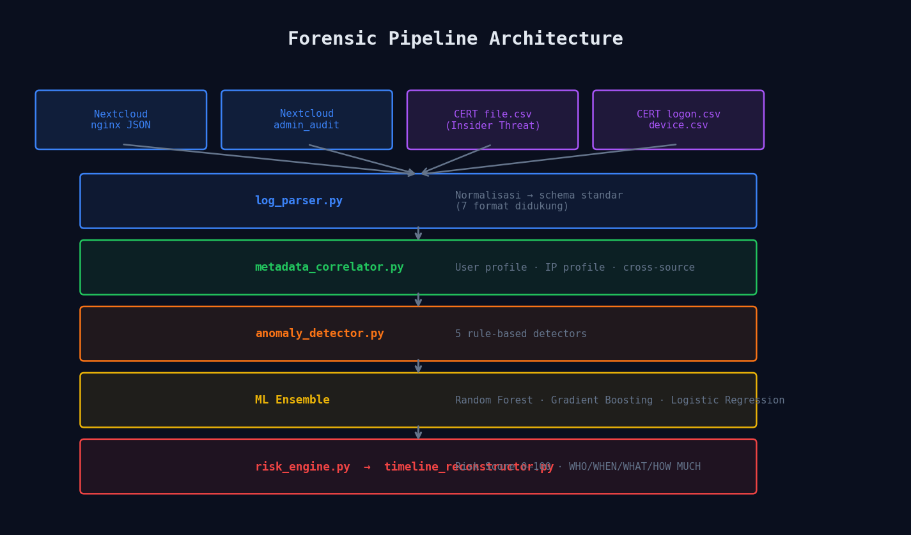
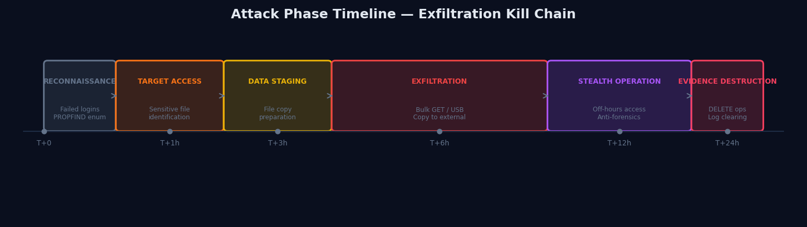
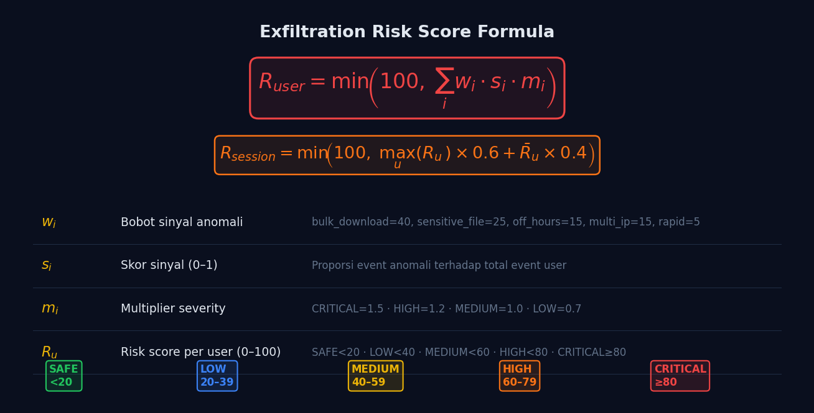
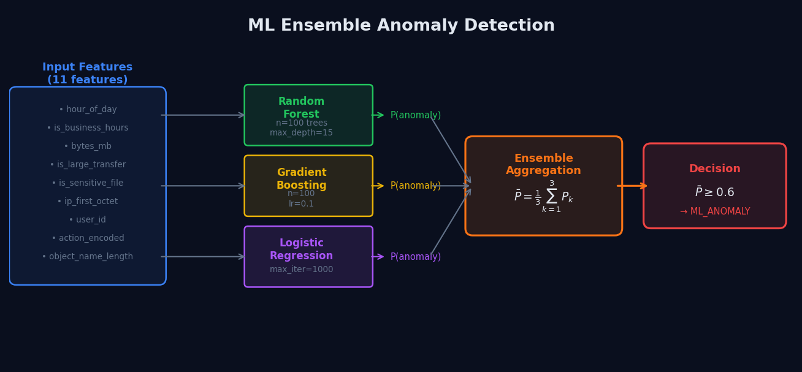
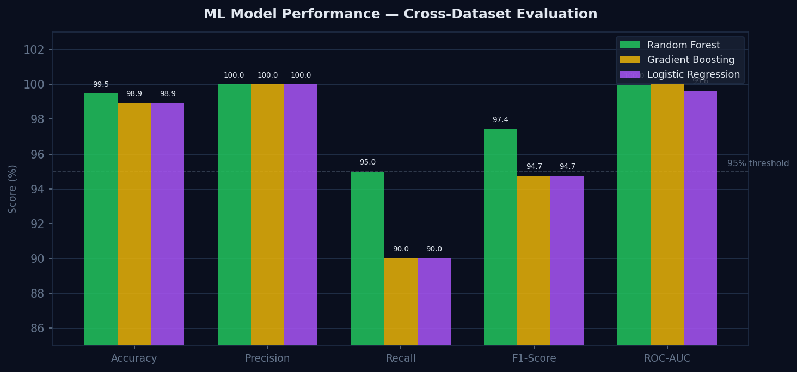
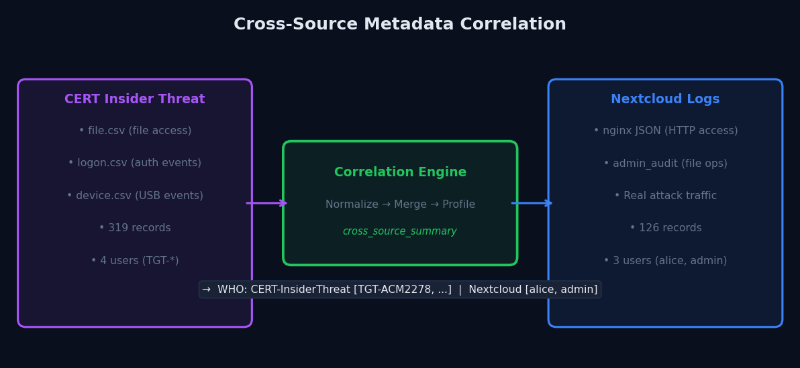

# Forensic Reconstruction of Unauthorized Data Exfiltration
## in Private Cloud Storage using Distributed Metadata Analysis and Machine Learning

> **Digital Forensics — Research-Based Project**
> Sistem forensik digital end-to-end yang mensimulasikan serangan eksfiltrasi data pada Nextcloud, mengintegrasikan dataset publik CERT Insider Threat, menganalisis metadata terdistribusi dengan ML ensemble, dan merekonstruksi timeline serangan melalui web dashboard 9 halaman.

---

## Arsitektur

```
┌──────────────────────────────────────────────────────────────┐
│  Docker Compose Stack                                        │
│                                                              │
│  nc-db (Postgres 16)  ←──┐                                  │
│  nc-redis             ←──┤                                  │
│  nc-app (Nextcloud 29-fpm)│  Target System  :8080           │
│  nc-web (Nginx)       ────┤                                  │
│  nc-cron                  │                                  │
│         │ shared volumes  │                                  │
│         ▼                 │                                  │
│  logs/nginx/access.log    │                                  │
│  logs/nextcloud/*.log     │                                  │
│         │                 │                                  │
│         ▼                 │                                  │
│  forensic-dashboard ──────┘  Forensic Engine  :5002         │
│  (Flask + ML Pipeline)                                       │
└──────────────────────────────────────────────────────────────┘
```

### Komponen

| Container | Image | Port | Fungsi |
|---|---|---|---|
| `nc-db` | postgres:16 | — | Database Nextcloud |
| `nc-redis` | redis:7-alpine | — | Cache/session |
| `nc-app` | nextcloud:29-fpm | — | Aplikasi Nextcloud |
| `nc-web` | nginx:1.27-alpine | 8080 | Reverse proxy + log generator |
| `nc-cron` | nextcloud:29-fpm | — | Background jobs |
| `forensic-dashboard` | df-dashboard | 5002 | Forensic engine + web UI |

---

## Quick Start

### 1. Jalankan seluruh stack

```bash
cd /home/hilian/Documents/df
docker compose up -d
```

Tunggu ~90 detik untuk Nextcloud first-run setup.

### 2. Verifikasi

```bash
docker compose ps
curl http://localhost:8080/status.php   # Nextcloud
curl http://localhost:5002/health       # Dashboard
```

### 3. Akses

| URL | Kredensial | Fungsi |
|---|---|---|
| http://localhost:8080 | admin / admin_password_change_me | Nextcloud |
| http://localhost:5002 | admin / forensic2024 | Forensic Dashboard |

---

## Menjalankan Serangan & Analisis

### Setup target (sekali saja)

```bash
# Buat user korban
curl -u "admin:admin_password_change_me" -X POST \
  "http://localhost:8080/ocs/v1.php/cloud/users" \
  -H "OCS-APIRequest: true" \
  -d "userid=alice&password=alice_secret_123"

# Upload file sensitif
for f in financial_report_2024.xlsx customer_database.csv api_keys.txt \
          technical_architecture.pdf private_certificates.pem; do
  curl -u "alice:alice_secret_123" -T /tmp/$f \
    "http://localhost:8080/remote.php/dav/files/alice/$f"
done
```

### Eksekusi serangan nyata

```bash
# Phase 1: Reconnaissance (failed logins)
for i in 1 2 3; do
  curl -u "alice:wrong_pass" http://localhost:8080/remote.php/dav/files/alice/
done

# Phase 2: Enumerasi file
curl -u "alice:alice_secret_123" -X PROPFIND \
  http://localhost:8080/remote.php/dav/files/alice/ -H "Depth: 1"

# Phase 3: Bulk download (eksfiltrasi)
for f in financial_report_2024.xlsx customer_database.csv api_keys.txt \
          technical_architecture.pdf private_certificates.pem; do
  curl -u "alice:alice_secret_123" -o /tmp/stolen_$f \
    "http://localhost:8080/remote.php/dav/files/alice/$f"
  sleep 0.3
done
```

### Ingest log & analisis

```bash
source venv/bin/activate

# Copy log dari container
cp logs/nginx/access.log logs/nc_nginx_access.log
cp logs/nextcloud/nextcloud.log logs/nc_nextcloud.log

# Ingest ke pipeline
python main.py --ingest logs/nc_nginx_access.log
python main.py --ingest logs/nc_nextcloud.log

# Jalankan full pipeline
python main.py --output data/forensic_report.json
```

---

## Dataset Publik: CERT Insider Threat

Project ini mengintegrasikan **CERT Insider Threat Dataset r4.2** (Carnegie Mellon University) sebagai dataset publik untuk validasi dan cross-dataset evaluation model ML.

**Sumber:** https://kilthub.cmu.edu/articles/dataset/CERT_Insider_Threat_Dataset/12841247

### Opsi 1: Sample data bawaan (tanpa download)

```bash
source venv/bin/activate
python scripts/load_cert_dataset.py --sample
python main.py --output data/forensic_report.json
```

Skenario yang di-generate:
- `TGT-ACM2278` — bulk copy 7 file sensitif ke USB di luar jam kerja (insider threat)
- 3 user normal dengan aktivitas file biasa selama 2 minggu

### Opsi 2: Dataset CERT asli

1. Download dari link di atas (registrasi gratis)
2. Ekstrak file CSV yang diinginkan
3. Ingest ke pipeline:

```bash
# File access events
python scripts/load_cert_dataset.py --file path/to/file.csv --type file

# Logon events
python main.py --ingest path/to/logon.csv

# Device/USB events
python main.py --ingest path/to/device.csv
```

### Format CSV yang didukung

| File CERT | Kolom utama | Keterangan |
|---|---|---|
| `file.csv` | id, date, user, pc, filename, activity, to_removable_media | File access + USB exfil |
| `logon.csv` | id, date, user, pc, activity | Login/logout events |
| `device.csv` | id, date, user, pc, activity | USB connect/disconnect |
| `http.csv` | id, date, user, pc, url, activity | Web browsing |

---

## Machine Learning Pipeline

Model ML digunakan sebagai layer deteksi tambahan di atas rule-based detectors.

### Training

```bash
source venv/bin/activate

# 1. Siapkan dataset (synthetic + CERT)
python scripts/ml_dataset_preparation.py

# 2. Training 3 model (Random Forest, Gradient Boosting, Logistic Regression)
python scripts/ml_training.py

# 3. Prediksi pada data terbaru
python scripts/ml_prediction.py --db-predict
```

### Hasil Training (cross-dataset evaluation)

| Model | Accuracy | Precision | Recall | F1 | ROC-AUC |
|---|---|---|---|---|---|
| Random Forest | 99.47% | 100% | 95.0% | 97.44% | 99.97% |
| Gradient Boosting | 98.94% | 100% | 90.0% | 94.74% | 100% |
| Logistic Regression | 98.94% | 100% | 90.0% | 94.74% | 99.64% |

> Dataset training: 756 sampel synthetic (benign + malicious dengan overlap realistis).
> Test set: 189 sampel. `source_encoded` di-drop untuk mencegah data leakage.

### Integrasi ke Pipeline

ML prediction otomatis berjalan saat `python main.py` — hasilnya muncul sebagai `ML_ANOMALY` di section WHAT laporan forensik, di samping rule-based detectors.

---

## Diagrams & Formulas

### Pipeline Architecture


### Attack Phase Timeline


### Exfiltration Risk Score Formula


> **Keterangan:**
> - **w_i** = bobot sinyal: `bulk_download=40`, `sensitive_file=25`, `off_hours=15`, `multi_ip=15`, `rapid_succession=5`
> - **s_i** = proporsi event anomali terhadap total event user (0–1)
> - **m_i** = severity multiplier: `CRITICAL=1.5`, `HIGH=1.2`, `MEDIUM=1.0`, `LOW=0.7`
> - **R_session** = kombinasi max score (60%) + rata-rata (40%) semua user

### ML Ensemble Architecture


> **Decision rule:** event diklasifikasikan `ML_ANOMALY` jika rata-rata probabilitas ensemble ≥ 0.6 (60%)

### ML Model Performance


### Cross-Source Metadata Correlation


---

## Pipeline Forensik

```
Data Sources
  ├── Nextcloud nginx JSON log
  ├── Nextcloud admin_audit log
  └── CERT Insider Threat CSV (file / logon / device)
          │
          ▼
    log_parser.py          → Normalisasi ke schema standar
          │
          ▼
    metadata_correlator.py → User profile + IP profile + cross-source correlation
          │
          ▼
    anomaly_detector.py    → 5 rule-based detectors:
          │                   bulk_download, multi_ip, off_hours,
          │                   sensitive_file_access, rapid_succession
          │
          ▼
    ML ensemble            → Random Forest + Gradient Boosting + Logistic Regression
          │                   (confidence threshold: 60%)
          ▼
    risk_engine.py         → Exfiltration Risk Score (0–100) per user + session
          │
          ▼
    timeline_reconstructor → Timeline kronologis dengan phase label
          │
          ▼
    Forensic Report (JSON) → who / when / what / how / how_much
                             + cross_source_summary (CERT vs Nextcloud)
```

### Format output laporan

```json
{
  "session_risk_score": 76,
  "session_risk_band": "HIGH",
  "who": {
    "alice": {
      "risk_score": 76, "risk_band": "HIGH",
      "total_events": 24, "data_source": "Nextcloud"
    },
    "TGT-ACM2278": {
      "risk_score": 45, "risk_band": "LOW",
      "total_events": 87, "data_source": "CERT-InsiderThreat"
    }
  },
  "when": {
    "first_event": "2010-01-04T16:05:00",
    "last_event":  "2026-04-26T03:42:00+00:00",
    "attack_phases": { "EXFILTRATION": 72, "STEALTH_OPERATION": 365 }
  },
  "what": [
    { "severity": "CRITICAL", "type": "BULK_DOWNLOAD",
      "description": "Bulk download: 15 GET ops, 1.3 MB total" },
    { "severity": "CRITICAL", "type": "ML_ANOMALY",
      "description": "ML ensemble flagged event (confidence 95%)" }
  ],
  "cross_source_summary": {
    "CERT-InsiderThreat": ["TGT-ACM2278", "TGT-BDK0391"],
    "Nextcloud": ["alice", "admin"]
  }
}
```

---

## Web Dashboard (port 5002)

Dashboard 9 halaman dengan full forensic control:

| Halaman | Fungsi |
|---|---|
| **Case Overview** | Risk gauge, suspect ranking, phase distribution chart, volume chart |
| **Suspect Profiles** | Behavioral analysis per aktor, signal bars, anomaly list |
| **Reconstruction** | Laporan forensik terstruktur: WHO / WHEN / WHAT / HOW MUCH |
| **Attack Timeline** | Timeline kronologis dengan phase label, filter per suspect |
| **Evidence** | Anomaly cards dengan filter severity (LOW/MEDIUM/HIGH/CRITICAL) |
| **Raw Logs** | Tabel paginated 50/page, filter user/IP/operation/source |
| **Dataset** | Cross-source breakdown CERT vs Nextcloud, user exfil stats |
| **ML Analysis** | Model performance bars, training info, live prediction tester |
| **Attack Simulator** | Launch 5 skenario serangan langsung ke Nextcloud |

---

## API Dashboard (port 5002)

| Method | Endpoint | Fungsi |
|---|---|---|
| POST | `/login` | Login (admin/forensic2024) |
| GET | `/api/stats` | Statistik keseluruhan |
| GET | `/api/risk-score` | Exfiltration Risk Score + anomalies |
| GET | `/api/reconstruction` | Full forensic report (who/when/what/how_much) |
| GET | `/api/logs/raw` | Log mentah (paginated, filter: user/ip/operation/source) |
| GET | `/api/alerts` | Alert HIGH/CRITICAL (filter: min_severity/user/type) |
| POST | `/api/analysis/correlate` | Jalankan metadata correlator |
| POST | `/api/simulate` | Trigger attack simulation |
| GET | `/api/dataset/summary` | Cross-source breakdown CERT vs Nextcloud |
| GET | `/api/dataset/cert-sample` | Info CERT sample dataset |
| GET | `/api/ml/summary` | Model performance metrics |
| POST | `/api/ml/predict` | Live ML prediction untuk satu event |
| GET | `/api/logs/tail/<file>` | Tail log file |

### Contoh

```bash
# Risk score
curl http://localhost:5002/api/risk-score | python3 -m json.tool

# Filter log by user dan source
curl "http://localhost:5002/api/logs/raw?user=alice&source=nextcloud&per_page=20"

# Alert CRITICAL saja
curl "http://localhost:5002/api/alerts?min_severity=CRITICAL"

# Dataset breakdown
curl http://localhost:5002/api/dataset/summary | python3 -m json.tool

# ML prediction
curl -X POST http://localhost:5002/api/ml/predict \
  -H "Content-Type: application/json" \
  -d '{"user":"attacker1","source_ip":"108.97.44.37","object":"api_keys.txt","bytes_transferred":262144000,"action":"GetObject"}'

# Trigger simulasi
curl -X POST http://localhost:5002/api/simulate \
  -H "Content-Type: application/json" \
  -d '{"scenario":"bulk_download","attacker":"attacker1","files":5}'
```

---

## Modul Forensik

| File | Fungsi |
|---|---|
| `analysis/log_parser.py` | Parse nginx JSON, Nextcloud audit, CERT file/logon/device CSV, MinIO, S3 |
| `analysis/metadata_correlator.py` | User profile, IP profile, shared IPs, contested files |
| `analysis/anomaly_detector.py` | 5 rule-based detectors |
| `analysis/timeline_reconstructor.py` | Timeline dengan phase label (EXFILTRATION, TARGET_ACCESS, dll) |
| `analysis/risk_engine.py` | Distributed Metadata Correlation Engine, Risk Score 0–100 |
| `dashboard/app.py` | Flask API (18 endpoint) + web dashboard |
| `main.py` | CLI entry point + ML integration |
| `scripts/load_cert_dataset.py` | Load CERT Insider Threat Dataset (sample atau asli) |
| `scripts/ml_dataset_preparation.py` | Prepare training dataset (synthetic + CERT) |
| `scripts/ml_training.py` | Training 3 model dengan cross-dataset evaluation |
| `scripts/ml_prediction.py` | Inference / prediksi pada data baru |

### Format log yang didukung

| Format | Deteksi | Field utama |
|---|---|---|
| Nextcloud nginx JSON | `request_method` + `remote_addr` | timestamp, user dari DAV path, bytes_sent |
| Nextcloud admin_audit | `reqId` + `app:admin_audit` | time, user, method, message |
| CERT file.csv | header `id,date,user,pc,filename` | date, user, pc, filename, activity, to_removable_media |
| CERT logon.csv | header `id,date,user,pc,activity` (no filename) | date, user, pc, activity (Logon/Logoff) |
| CERT device.csv | nama file `device.csv` | date, user, pc, activity (Connect/Disconnect) |
| MinIO audit JSON | `api` + `requestUserAgent` | time, principalId, objectSize |
| S3 access log | space-delimited | bucket, requester, operation |

---

## Konfigurasi

### `.env`

```env
POSTGRES_PASSWORD=forensic_db_pass
NEXTCLOUD_ADMIN_USER=admin
NEXTCLOUD_ADMIN_PASSWORD=admin_password_change_me
```

### `config/config.py` — threshold anomali

```python
ANOMALY_THRESHOLDS = {
    'bulk_download_count':  5,    # min GET ops untuk flag bulk download
    'bulk_download_size_mb': 500, # min MB
    'ip_change_threshold':  5,    # min unique IPs (+ harus ada GET)
}

SENSITIVE_FILES = [
    'financial_report_2024.xlsx', 'customer_database.csv',
    'api_keys.txt', 'technical_architecture.pdf',
    'private_certificates.pem', 'hr_records_2024.xlsx',
    'source_code_backup.zip',
]
```

---

## Struktur Folder

```
df/
├── docker-compose.yml
├── Dockerfile.dashboard
├── .env
├── nginx.conf
├── nextcloud.nginx.conf
├── forensic.nextcloud.config.php
│
├── main.py                     # CLI entry point + ML integration
├── requirements.txt
│
├── analysis/
│   ├── log_parser.py           # Multi-format parser (7 format)
│   ├── metadata_correlator.py
│   ├── anomaly_detector.py     # 5 rule-based detectors
│   ├── timeline_reconstructor.py
│   └── risk_engine.py
│
├── dashboard/
│   ├── app.py                  # Flask API (18 endpoint)
│   └── templates/dashboard.html  # Web UI (9 halaman)
│
├── config/
│   ├── config.py
│   └── utils.py
│
├── scripts/
│   ├── attack_simulator.py     # 5 skenario serangan
│   ├── load_cert_dataset.py    # Load CERT Insider Threat Dataset
│   ├── ml_dataset_preparation.py
│   ├── ml_training.py          # Cross-dataset evaluation
│   ├── ml_prediction.py
│   └── ml_utils.py
│
├── data/
│   ├── forensic.db             # SQLite database
│   ├── forensic_report.json    # Output laporan terakhir
│   ├── cert_sample.csv         # CERT sample dataset
│   └── ml_datasets/            # Training datasets
│       ├── engineered_features.csv
│       ├── combined_dataset.csv
│       └── ...
│
├── models/                     # Trained ML models
│   ├── RandomForest_model.pkl
│   ├── GradientBoosting_model.pkl
│   ├── LogisticRegression_model.pkl
│   ├── feature_names.json
│   └── training_results.json
│
└── logs/
    ├── nginx/                  # Shared dari nc-web container
    └── nextcloud/              # Shared dari nc-app container
```

---

## Troubleshooting

**Nextcloud 503 saat pertama kali**
```bash
docker compose logs nc-app | tail -20
# Normal jika masih "Initializing" — tunggu sampai 90 detik
```

**Dashboard unhealthy tapi bisa diakses**
```bash
docker compose logs dashboard | tail -5
```

**Log nginx kosong**
```bash
curl http://localhost:8080/
ls -la logs/nginx/
```

**Reset total**
```bash
docker compose down -v
docker compose up -d
```

---

## Perintah Berguna

```bash
# Status semua container
docker compose ps

# Lihat log real-time
docker compose logs -f nc-web dashboard

# Jalankan pipeline manual
source venv/bin/activate
python main.py --output data/forensic_report.json

# Load CERT dataset + pipeline
python scripts/load_cert_dataset.py --sample
python main.py --output data/forensic_report.json

# Retrain ML model
python scripts/ml_dataset_preparation.py
python scripts/ml_training.py

# Ingest log terbaru dari container
docker exec forensic-dashboard sh -c \
  "cp /app/logs/nginx/access.log /app/logs/nc_nginx_access.log && \
   python main.py --ingest /app/logs/nc_nginx_access.log"
```
